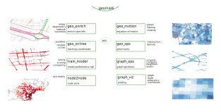

# geomadi

geomadi is a library for spatial operations

_overview of geomadi modules_

## demand prediction

[demand prediction](docs/activation.md)

* theoretical activation potential
* aggregation of demand and offer on geohash

## location 

* enrichment of geo features on geohash
* prediction on single geohash

[spatial operations and geographical transformation](docs/location.md)

## evaluate operations metrics

* restructuring data based on quantities of interest
* motion patterns

[evaluates operations](docs/ride.md)

## optimization engine

* Monte Carlo and Markov chains
* convergent solutions

[optimization engine](docs/optimization.md)

## dynamics of motion

[dynamics of motion](docs/motion.md)

* from coordinates to dynamic of motion
* city mobility

## routing and graphs

[routing and graphs](docs/routing.md)

* building an efficient graph based on mean of transportation
* finding the most optimal path and calculating weighting matrices

